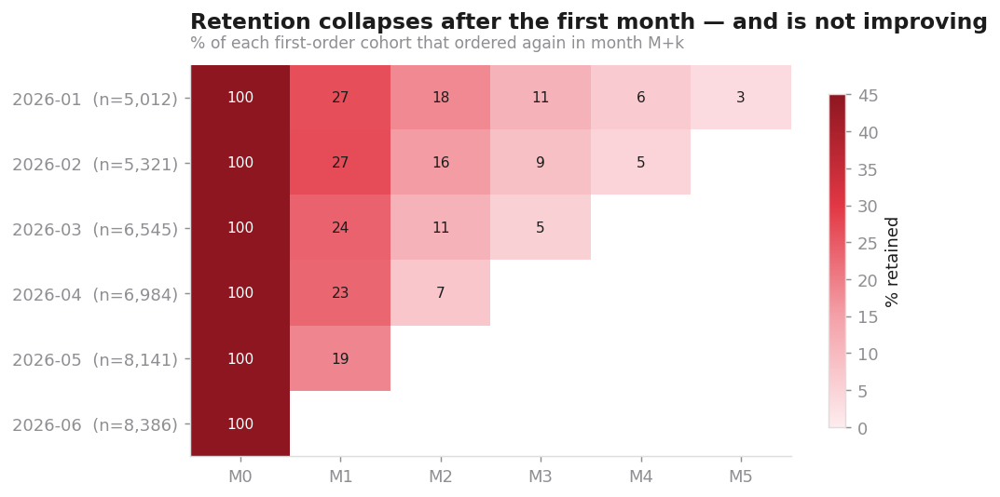
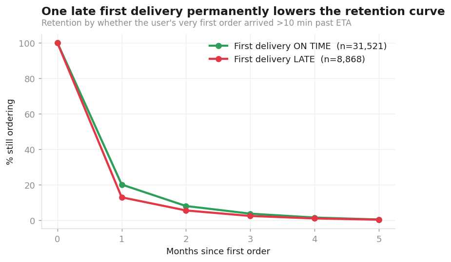
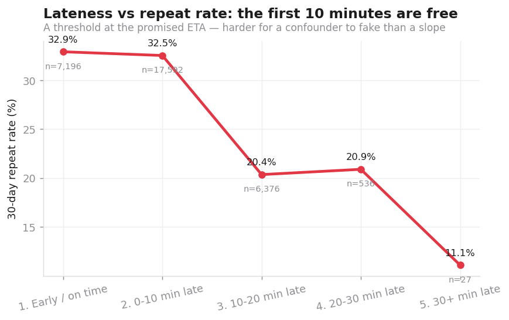
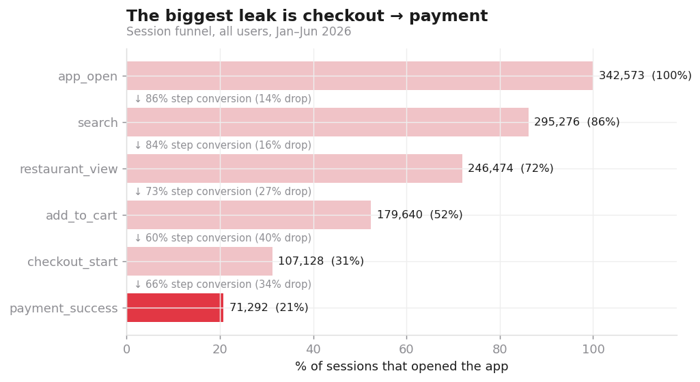
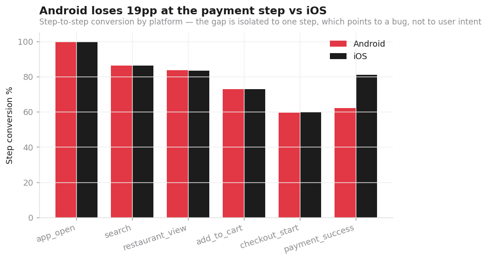
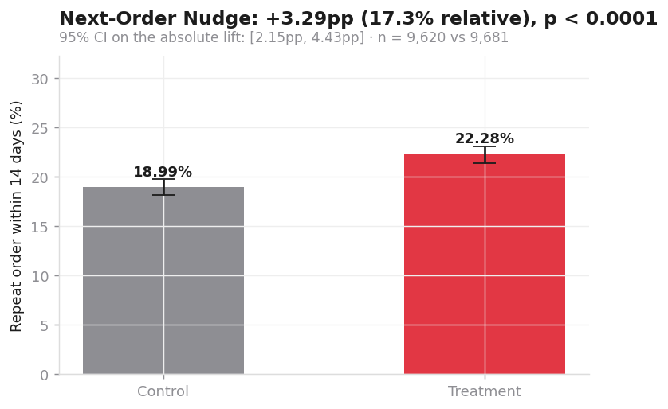
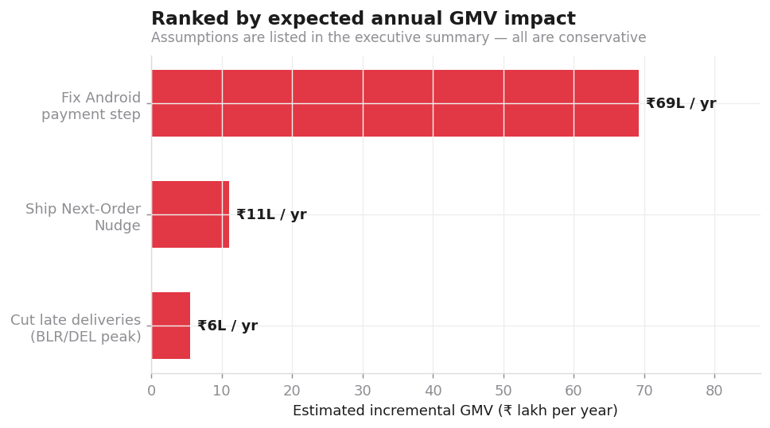

# The Second-Order Problem
### A product-analytics case study on a food-delivery marketplace

> **67.3% of registered users place a first order. Only 29.9% place a second one
> within 30 days.** This project finds out why, sizes each cause in rupees, runs an
> experiment on the fix, and ships a monitor so the answer stays current.

`SQL` · `Python` · `cohort retention` · `funnel analysis` · `RFM segmentation` ·
`A/B testing` · `Streamlit` · `automated monitoring`

---

## The one-minute version

| | |
|---|---|
| **Business question** | Why do new users not place a second order, and which fix is worth the most GMV? |
| **North-star metric** | 30-day repeat rate of new users — currently **29.9%** |
| **Finding 1** | A **late first delivery** cuts the 30-day repeat rate by **11.8pp** (12.2pp raw, adjusted across 69 confounder cells), with a threshold effect at the promised ETA |
| **Finding 2** | Checkout→payment converts at **62.0% on Android vs 81.0% on iOS** — one broken step, ~**15,491** lost orders in 6 months |
| **Finding 3** | Paid-social users repeat at **21.6%** vs **35.5%** for referral, on the heaviest discounts |
| **Experiment** | "Next-Order Nudge" (₹75 off, 7 days): **+3.29pp** repeat rate, 95% CI [2.15, 4.43], p < 0.0001 |
| **Decision** | **Ship the nudge targeted**, fix the Android payment step first, and fund rider capacity at peak in the two worst cells |
| **Estimated impact** | **≈ ₹86 lakh incremental GMV per year** on a 60k-user base, assumptions stated |

📄 **[Read the 1-page executive summary →](reports/EXECUTIVE_SUMMARY.md)**

---

## The headline charts

**Retention collapses after month 1, and later cohorts are worse than earlier ones.**



**One late first delivery permanently lowers the whole retention curve.**



**The first ~10 minutes are free; past the promised ETA, repeat rate steps down. A
threshold that lines up with the promise is hard for a confounder to fake.**



**The funnel's biggest leak is checkout → payment …**



**… and it is almost entirely an Android problem. Every earlier step matches iOS.**



**The experiment: a real lift, with a real guardrail cost.**



**Every finding, priced.**



---

## How I framed it

A product analyst's job is not to produce charts; it is to change a decision. So the
project is built backwards from the decision:

1. **Define the metric before looking at data.**
   *North star:* 30-day repeat rate of new users. It is the earliest reliable predictor
   of LTV in food delivery, it is fast to move, and — unlike "orders" — it cannot be
   faked by buying more traffic. Measured only on **matured cohorts** (first order ≥30
   days before the cut-off) so right-censoring does not flatter it.
   *Guardrails:* cancellation rate, avg delivery time, avg rating, discount % of GMV,
   net revenue per order. A win on the north star that breaks a guardrail is not a win.

2. **Find where the metric leaks** — cohorts, funnel, segments.

3. **Separate correlation from cause.** The headline finding is observational, so it is
   stress-tested three ways: stratification across 69 confounder cells, a dose–response
   curve, and a randomised experiment on the recommended fix.

4. **Price every finding in rupees**, with the assumptions written down where a
   sceptical reader can attack them.

5. **Automate it** so the answer does not go stale the day after the deck is presented.

## What's in the repo

```
food-delivery-product-analytics/
├── README.md                      ← you are here
├── reports/
│   ├── EXECUTIVE_SUMMARY.md       ← the 1-pager for a PM
│   ├── weekly_monitor.md          ← auto-generated metric health report
│   └── results.json               ← every number, machine-readable
├── sql/                           ← the analytics layer (named, commented query blocks)
│   ├── 01_metrics.sql             north star, guardrails, monthly trend
│   ├── 02_cohort_retention.sql    cohort matrix + retention by first-delivery experience
│   ├── 03_funnel.sql              session funnel, segmented, + "size the prize"
│   ├── 04_segmentation.sql        RFM (NTILE), acquisition-channel quality
│   ├── 05_drivers.sql             driver analysis, stratification, dose–response
│   └── 06_ab_test.sql             SRM check, balance, primary metric, guardrails, HTE
├── src/
│   ├── generate_data.py           the simulator, with its causal structure documented
│   ├── sqlkit.py                  loads named SQL blocks; SQL stays the source of truth
│   ├── run_analysis.py            runs everything → charts/ + results.json
│   ├── make_report.py             renders README + exec summary FROM results.json
│   └── monitor.py                 weekly monitoring + RED/AMBER alerting, non-zero exit
├── dashboard/app.py               Streamlit self-serve dashboard
├── charts/                        12 publication-styled charts
└── data/                          CSVs + delivery.db (SQLite)
```

## Reproduce it

```bash
pip install -r requirements.txt
python3 src/generate_data.py     # build data/delivery.db      (~10s, seeded)
python3 src/run_analysis.py      # all analyses -> charts/ + reports/results.json
python3 src/make_report.py       # regenerate README + executive summary
python3 src/monitor.py           # weekly metric health check (exit 1 if RED)
streamlit run dashboard/app.py   # interactive dashboard
```

Everything is seeded (`np.random.default_rng(42)`) — the same numbers come out every time.

## About the data — read this before judging it

The data is **simulated**, deliberately and transparently.

Public food-delivery datasets have orders but **no event/clickstream table and no
experiment assignment table**, which makes funnel analysis and A/B analysis impossible.
Rather than skip the two techniques the job actually asks for, I wrote a simulator with
an explicit causal structure (`src/generate_data.py`, documented at the top of the file)
and then tried to **recover** that structure with SQL and statistics — including one
finding I got wrong on the first pass because my event generator silently erased the
platform gap I had injected.

What this means for a reader:
- **The effect sizes are properties of my simulation.** Do not quote them as facts
  about any real company.
- **The metric definitions, the queries, the stratification, the experiment design, the
  guardrail logic, and the decision framework are exactly what you would use in
  production** — those are the parts worth reviewing.

## Data-quality notes (the honest section)

- **Right-censoring:** later cohorts have less time to repeat. Every retention figure is
  restricted to matured cohorts; the May/June rows of the cohort matrix are shown but
  should not be compared to January's M1 without that caveat.
- **Cancelled orders** are excluded from GMV and retention but kept for the
  cancellation guardrail.
- **"Late" is defined as >10 min past the promised ETA**, not >0 — a 2-minute overrun is
  not a bad experience, and the threshold materially changes the headline number.
- **The lateness→retention link is observational.** Stratified and dose-response tested,
  but the clean answer needs a geo experiment (proposed in the summary).
- **Attribution:** acquisition channel is last-touch at signup; multi-touch would shift
  the channel comparison.

## Reference numbers

**Monthly trend**

| month | active_users | orders | gmv_lakh | aov | late_rate_pct | discount_pct_of_gmv |
| --- | --- | --- | --- | --- | --- | --- |
| 2026-01 | 5012 | 6097 | 25.4 | 417.0 | 20.7 | 25.9 |
| 2026-02 | 6655 | 8942 | 39.1 | 437.0 | 21.1 | 20.5 |
| 2026-03 | 8893 | 12608 | 56.9 | 452.0 | 20.9 | 18.8 |
| 2026-04 | 9934 | 13736 | 62.6 | 456.0 | 20.5 | 18.5 |
| 2026-05 | 11290 | 14949 | 67.8 | 454.0 | 20.4 | 19.2 |
| 2026-06 | 11190 | 13673 | 61.0 | 446.0 | 20.9 | 20.7 |

**Funnel**

| step_no | event_name | sessions | pct_of_top | step_conv_pct |
| --- | --- | --- | --- | --- |
| 1 | app_open | 342573 | 100.0 |  |
| 2 | search | 295276 | 86.2 | 86.2 |
| 3 | restaurant_view | 246474 | 71.9 | 83.5 |
| 4 | add_to_cart | 179640 | 52.4 | 72.9 |
| 5 | checkout_start | 107128 | 31.3 | 59.6 |
| 6 | payment_success | 71292 | 20.8 | 66.5 |

**RFM segments**

| segment | users | pct_users | pct_gmv | avg_orders | avg_lifetime_gmv |
| --- | --- | --- | --- | --- | --- |
| Champions | 7551 | 18.7 | 36.9 | 3.03 | 1529.0 |
| Loyal | 7929 | 19.6 | 21.9 | 1.91 | 863.0 |
| At Risk (was valuable) | 5100 | 12.6 | 17.1 | 2.39 | 1051.0 |
| Hibernating / Churned | 7403 | 18.3 | 8.9 | 1.0 | 376.0 |
| Needs Attention | 6697 | 16.6 | 8.1 | 1.0 | 379.0 |
| New / Promising | 5709 | 14.1 | 7.1 | 1.0 | 387.0 |

**Acquisition channels** — note `repeat_rate_pct` here is *lifetime* (≥2 orders ever, all
ordering users). The executive summary quotes the **north-star definition** instead
(repeat within 30 days, matured cohorts only), which runs ~2pp higher. Same ranking, and
the ranking is the point.

| acquisition_channel | ordering_users | repeat_rate_pct | orders_per_user | gmv_per_user | discount_pct_of_gmv |
| --- | --- | --- | --- | --- | --- |
| referral | 5858 | 32.0 | 1.86 | 848.0 | 18.0 |
| organic | 14343 | 30.1 | 1.85 | 851.0 | 18.0 |
| paid_search | 9292 | 27.9 | 1.75 | 790.0 | 18.6 |
| paid_social | 10896 | 19.4 | 1.49 | 620.0 | 26.5 |

---

*Built by Vaibhav Divakar · BITS Pilani (Goa), EEE, 2027 · targeting Product Analyst roles.
Feedback welcome — especially on the parts you think are wrong.*
